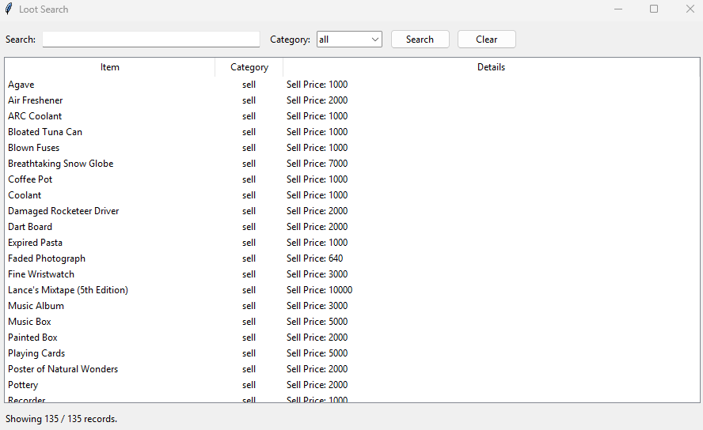

# ARC Raiders Loot Database

This repository contains three structured JSON files:

* `safe_to_sell.json`
* `safe_to_recycle.json`
* `what_to_keep.json`

These are used by the Python desktop app to provide fast keyword-based searching across all loot categories.

---

## Application Screenshot

Below is a preview of the search application interface:

